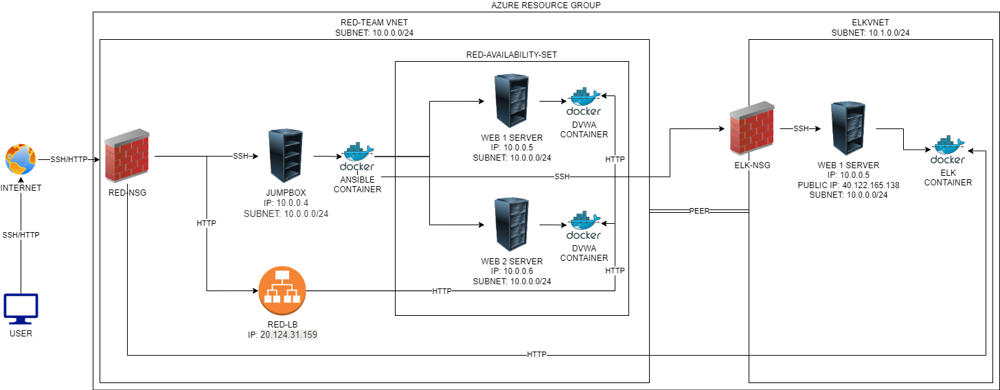

## Automated ELK Stack Deployment

The files in this repository were used to configure the network depicted below.

These files have been tested and used to generate a live ELK deployment on Azure. They can be used to either recreate the entire deployment pictured above. Alternatively, select portions of the `playbook` file may be used to install only certain pieces of it, such as Filebeat.

- [install-webserver.yml](Ansible/install-webserver.yml)
- [install-elk.yml](Ansible/install-elk.yml)
- [install-filebeat.yml](Ansible/install-filebeat.yml)
- [install-metricbeat.yml](Ansible/install-metricbeat.yml)

This document contains the following details:
- Description of the Topology
- Access Policies
- ELK Configuration
  - Beats in Use
  - Machines Being Monitored
- How to Use the Ansible Build

### Description of the Topology

The main purpose of this network is to expose a load-balanced and monitored instance of DVWA, the D*mn Vulnerable Web Application.

Load balancing ensures that the application will be highly `available`, in addition to restricting `SSH access` to the network.
- _What aspect of security do load balancers protect? What is the advantage of a jump box?_
  - Load balancers protect the availability of a server, so it can mitgate against DDOS attacks.
  - The advantage of a jumpbox helps reduce the attack vector to access SSH on the web servers.

Integrating an ELK server allows users to easily monitor the vulnerable VMs for changes to the `configuration files` and system `logs`.
- _What does Filebeat watch for?_
  - Filebeat watches for SSH logins, linux logins, and sudo commands. Filebeat is a lightweight shipper for forwarding and centralizing log data. Installed as an agent on your servers, Filebeat monitors the log files or locations that you specify, collects log events, and forwards them either to Elasticsearch or Logstash for indexing.
- _What does Metricbeat record?_
  - Metricbeat records CPU, RAM, and network usage. Metricbeat is a lightweight shipper that you can install on your servers to periodically collect metrics from the operating system and from services running on the server. Metricbeat takes the metrics and statistics that it collects and ships them to the output that you specify, such as Elasticsearch or Logstash

The configuration details of each machine may be found below.

| Name     | Function | IP Address | Operating System |
|----------|----------|------------|------------------|
| Jump Box | Gateway  | 10.0.0.4   | Linux            |
| Web-1     |Webserver          |    10.0.0.5        |       Linux           |
| Web-2    |  Webserver        |        10.0.0.6    |   Linux               |
| ELK    |  Security Monitoring Solution        |  10.1.0.4          | Linux                 |

### Access Policies

The machines on the internal network are not exposed to the public Internet. 

Only the `Jumpbox via SSH`, `Webservers via HTTP`, and `ELK via HTTP` machine can accept connections from the Internet. Access to this machine is only allowed from the following IP addresses:
- Jumpbox is only from my personal IP address.
- Webservers can be access by anyone via HTTP.
- ELK servers can be access from my personal IP address via HTTP.

Machines within the network can only be accessed by `Jumpbox`.
- _Which machine did you allow to access your ELK VM? What was its IP address?_
  - Jumpbox is the only machine that is allowed via SSH
  - My personal IP is the only machine that is allowed via HTTP to access the Kibana dashboard.

A summary of the access policies in place can be found in the table below.

| Name     | Publicly Accessible | Allowed IP Addresses |
|----------|---------------------|----------------------|
| Jump Box | Yes via SSH          | Personal Home IP    |
| Web-1         |    Yes                 |        Any              |
| Web-2         |    Yes                 |          Any            |
| ELK     |               Yes via HTTP      | Personal IP                      |
### Elk Configuration

Ansible was used to automate configuration of the ELK machine. No configuration was performed manually, which is advantageous because...
- _What is the main advantage of automating configuration with Ansible?_
  - We can install multiple softwares to multiple machines simultaneously and is less prone to human errors.

The playbook implements the following tasks:
- _TODO: In 3-5 bullets, explain the steps of the ELK installation play. E.g., install Docker; download image; etc._
- Install docker.io
- Install pip3
- Install Docker python moduel
- Change to use more memory for ELK
- Download and launch a Docker ELK container

The following screenshot displays the result of running `docker ps` after successfully configuring the ELK instance.

### Target Machines & Beats
This ELK server is configured to monitor the following machines:
- Web-1
- Web-2

We have installed the following Beats on these machines:
- Web-1
- Web-2

These Beats allow us to collect the following information from each machine:
- _In 1-2 sentences, explain what kind of data each beat collects, and provide 1 example of what you expect to see. E.g., `Winlogbeat` collects Windows logs, which we use to track user logon events, etc._
  - We used Filebeat which is to monitor for SSH logins, linux logins, and sudo commands.
  - We also used Metricbeat which is used to monitor for CPU, RAM, and network usage.

### Using the Playbook
In order to use the playbook, you will need to have an Ansible control node already configured. Assuming you have such a control node provisioned: 

SSH into the control node and follow the steps below:
- Copy the `playbook` file to `/etc/ansible`.
- Update the `hosts` file to include the `IPs of the servers you want to configure`.
- Run the playbook, and navigate to `the targeted machines` to check that the installation worked as expected.

_Answer the following questions to fill in the blanks:_
- _Which file is the playbook? Where do you copy it?_
  - The file that is the playbook is the following:
    - `install-webservers.yml`
    - `install-elk.yml`
    - I would copy this into the `/etc/ansible` directory.
- _Which file do you update to make Ansible run the playbook on a specific machine?_
  - Update the `hosts` file. 
- _How do I specify which machine to install the ELK server on versus which to install Filebeat on?_
  - In the yml script, I need to specifiy the `hosts` line to determine which group to install it to.
- _Which URL do you navigate to in order to check that the ELK server is running?
  - http://40.122.165.138:5601/
  - http://VM-IP:5601

